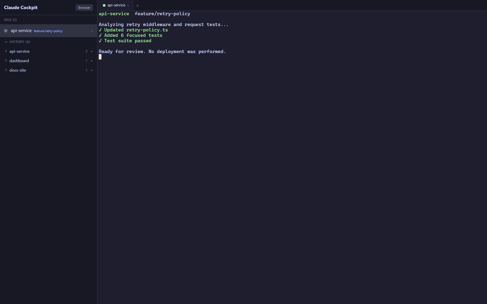
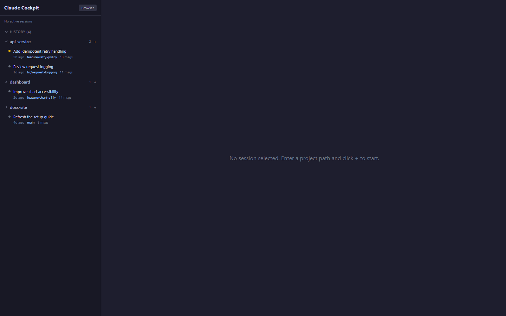

# Claude Cockpit

An unofficial desktop workspace for discovering, resuming, and operating multiple Claude Code sessions alongside project terminals and browser tabs.

This project is independent and is not affiliated with or endorsed by Anthropic.

## What it does

- Discovers local Claude Code session history and groups it by project.
- Resumes existing sessions or starts new ones in embedded terminals.
- Keeps project terminals and browser tabs associated with the active session.
- Restores session, terminal, and browser state between launches.
- Shows current Git branches for active projects.
- Supports an optional browser cookie bridge for users who explicitly enable it.

## Screenshots

These captures render the shipped desktop interface against synthetic projects, branches, commands, and session history. They show the workspace behavior without exposing local paths or private coding sessions.

### Session workspace



### Project and session history



## Requirements

- Node.js 20 or newer
- Windows, macOS, or Linux with a supported Electron runtime
- Claude Code installed and available as `claude`
- Native build prerequisites required by `node-pty`. On Windows, install Visual Studio 2022 Build Tools with the **Desktop development with C++** workload.

## Run locally

```powershell
npm install
npm run dev
```

`npm install` rebuilds `node-pty` for the bundled Electron version. If that step reports that no Visual Studio installation can be found on Windows, install the Build Tools workload above and rerun it.

Build and verify:

```powershell
npm test
npm run dist
```

The integration suite launches Electron and expects local Claude Code history. Run it separately with `npm run test:integration`.

## Security model

Claude Cockpit launches local shells and can resume coding-agent sessions. A session has the same filesystem and command access as the operating-system user who launched the application.

The UI includes explicit options to restart Claude Code with its permission bypass flag. That mode removes an important safety boundary and should only be used in a disposable or otherwise constrained environment.

Renderer windows use context isolation with Node integration disabled. The app still exposes deliberate terminal and browser capabilities through narrow preload APIs. Review the code before using it with sensitive projects.

### Optional cookie bridge

The cookie bridge can copy Chrome cookies into Cockpit's isolated Electron browser profile. It is disabled by default because cookies are credentials.

To enable it:

1. Generate a random token of at least 32 characters.
2. Set `COCKPIT_COOKIE_BRIDGE_TOKEN` before launching Cockpit.
3. Load `resources/chrome-extension` as an unpacked Chrome extension.
4. Paste the same token into the extension popup.

The server binds only to `127.0.0.1`, accepts Chrome-extension origins, requires the bearer token, limits request size, and does not persist the token. The Chrome extension stores the token locally in that browser profile. Anyone with access to the token or your unlocked desktop session may be able to reuse authenticated browser state.

## Local data

Session state and browser profile metadata are stored under Electron's per-user application-data directory. They are ignored by Git. The application reads Claude Code's local project session directory to discover resumable sessions.

## License

MIT. See [LICENSE](LICENSE).
